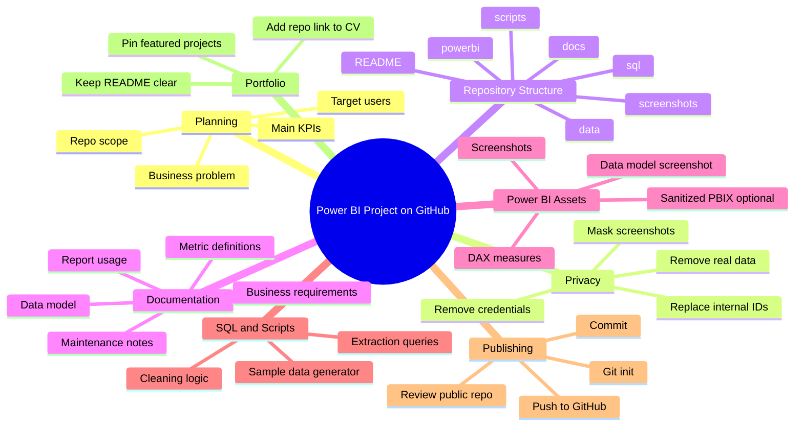

# Mind Map - Publishing a Power BI Project to GitHub

```mermaid
mindmap
  root((Power BI Project on GitHub))
    Planning
      Business problem
      Target users
      Main KPIs
      Repo scope
    Privacy
      Remove real data
      Mask screenshots
      Remove credentials
      Replace internal IDs
    Repository Structure
      README
      data
      docs
      sql
      powerbi
      screenshots
      scripts
    Documentation
      Business requirements
      Metric definitions
      Data model
      Report usage
      Maintenance notes
    Power BI Assets
      Sanitized PBIX optional
      Screenshots
      DAX measures
      Data model screenshot
    SQL and Scripts
      Extraction queries
      Cleaning logic
      Sample data generator
    Publishing
      Git init
      Commit
      Push to GitHub
      Review public repo
    Portfolio
      Add repo link to CV
      Pin featured projects
      Keep README clear
```
